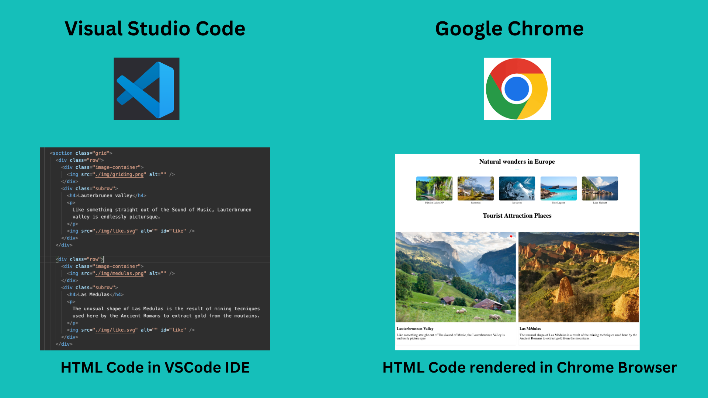

## Parts of a website

A website can have a couple of features or several features. There is no guideline that tells what a website should have but most of the time a website has the following common parts(components). For instance, if you look at the [first ever created website](http://info.cern.ch/hypertext/WWW/TheProject.html), it has just one page and several links. However, since 1993 to today, for the last three decades HTML has been evolving and with only HTML it is possible to develop a decent static website.

Let's see the most common parts(components) of a website:

- Website Logo
- Header/Banner
- Navigation Bar/Menu Bar
- Carousel
- Sections
- Forms
- Buttons
- Links
- Images
- Videos
- Audios
- Social Links
- Footer

If you agree that these are components of a website, then you will create these components to build a website. Actually, once you create a certain feature it can be used in different projects(reusable). Therefore, whenever you create a certain part try to consider maintainability and reusability.
You don't have to have all the mentioned above features when you develop a website. There is no strict guidelines what to have on your website.

## Introductin to HTML

### History of HTML

The initial release of HTML was 1993. The first version of HTML was written by Tim Berners-Lee in 1993. HTML has been evolving for the last three decades and the now the latest version is HTML5.

### What is HTML?

The word HTML is an acronym. That is stands for Hypertext Markup Language. It is the standard markup languages to develop websites. HTML is the build block of the web that allows building layouts of page using HTML elements. HTML is not not a programming language instead it is a markup language.

HTML code will be rendered by a browser and it give a human readable output. Look at the figure bellow to understand better how the HTML code convert to a website using a browser.



### HTML Element

HTML elements consists of an open tag(<>), attribute(s), content and closing tag(<>).
Look at the figure below to understand a syntax of an HTML element.


````html
<h1>I am Learning HTML from TECH I.S</h1>

The tag name is _h1_ and the content is _30 Days of HTML_. The h1 will tell the
browser to make the text a big font size that why we call HTML a markup
language. ```html
<p>
  HTML elements are the blocking of a website. There is not website without
  HTML. Learn HTML and build a website.
</p>
````

The _p_ tag marks the text to be paragraph that why we call HTML a markup language.

### Attribute

HTML attributes provide additional information about the element. An attribute can added only in the opening tag. It will be difficult to list down all HTML attributes but we can list down the most common ones.

- alt - to add information about added image, use with _img_ element.
- autocompelete - to enable auto complete feature of a form, use with form and input.
- autofocus - enable auto focus of input fields
- autoplay - allows playing an audio/video on the page loads
- charset - enable character encoding of meta tag
- checked - to make a checkbox checked of an input element
- class - to give a common identifier for HTML elements
- cols - to determine the width of a textarea element
- contenteditable - make any element editable
- download - allows a link to download a resource(image, pdf, PPT, etc)
- draggable - to make an element draggable, apply to all elements
- for - to connect/bound a label element with a specific input field, use with a label tag
- href - to specify a URL or a path of a resource, use with a link tag
- id - a unique id for an HTML element, apply to all elements
- lang - specifies the language of the page
- type - specifies the type of the element and it uses with only a certain elements
- src - to specify URL of a media file(img, audio, video, source, embed, script)
- style - to add an inline CSS style to an element

There are also event listener attribute that listen mouse or keyboard. For instance, onclick, onsubmit, onkeydown, onkeyup, onscroll, etc. Remember, do not try to remember by hard. For detail information about, HTML attributes you may check this [link](https://www.w3schools.com/tags/ref_attributes.asp)


An attribute is optional in an HTML element. See the following h1 tag with an id attribute value of _first-title_.

```html
<h1 id="start-title">I am Learning HTML from TECH I.S</h1>
```

An HTML element with multiple attributes

```html
<h1 id="start-title" class="title">I am Learning HTML from TECH I.S</h1>
```

```html
<p style="color:gray;">
  HTML elements are the blocking of a website. There is not website without
  HTML. Learn HTML and build a website.
</p>
```

The above _p_ tag has a style attribute. The style attribute has a color property and a value gray. The style changes the text color to gray. You can try it by adding other property and value in the style. Each value has to be separated by a semicolon.

Some HTML elements do not have closing tag, instead they have self-closing tag.


An example of self closing tags:

```html
<area />
<base />
<br />
<col />
<embed />
<hr />

<input />
<link />
<meta />
<para />
<source />
<track />
<wbr />
```

The slash is optional but I strongly recommend to use the slash with self-closing tags. For instance, React.js does not allow you to use without the slash.

### HTML Comment

Comment in any programming language help a code to be more readable. Therefore, it is common to leave some text on a code to make it more readable and maintainable. Let us the syntax of an HTML comment, it has opening (<!--) and closing(-->)

```html
<!-- The is an HTML comment and it makes the code more readable -->
```

## HTML Structure

In this section, we will start writing the DOM tree of an HTML document or file. DOM stands for Document Object Model. The DOM is structure like a true. It starts with an _html_ root element followed by head and body. The head and the body are the immediate children of the root element, _html_. Before the root element, there is a declaration.

### Declaration

Before the root element, there is a declaration. This declaration tells the browser that the document is an HTML. Therefore, the browser render it to the way an HTML suppose to be rendered.

This is the code to declare an HTML. The declaration is not part of the DOM tree.

```html
<!DOCTYPE html>
```

### Root Element

The _html_ element is the root of the DOM tree and is the parent of _head_ and _body_.

The DOM try has to be wrapped by the html tag.

```html
<!DOCTYPE html>
<html></html>
```

The _html_ tag with two children, head and body.

```html
<!DOCTYPE html>
<html>
  <head></head>
  <body>
    content goes here
  </body>
</html>
```

Create folder on the desktop and give it any name and even you may call it (HTML at TECH I.S), inside this folder create an index.html file. Every HTML file has to end with a .html extension. And it is good to have at least on index.html file in the a project and the reset of the file will have different names.

This a simplistic DOM structure that contains _html_, _head_, _title_, _body_, _h1_ elements.

```html
<!DOCTYPE html>
<html>
  <head>
    <title>HTML at TECH I.S</title>
  </head>
  <body>
    <h1 id="first-title">The Building Blocks of the web</h1>
  </body>
</html>
```

The DOM tree of the above HTML looks like the following diagram.


### Heading Elements

HTML is a markup language. We mark a content using an HTML tag and the browser render it to a clean web page. The h1 tag means making a text to be a large font size text, by default it creates 32px size text. We have h1 to h6 different tags to write different font size title. Pixel(px) is a unit to measure size which is as small as a dot.

```html
<!DOCTYPE html>
<html>
  <head>
    <title>HTML at TECH I.S</title>
  </head>
  <body>
    <h1>First level heading</h1>
    <h2>Second level heading</h2>
    <h3>Third level heading</h3>
    <h1>Fourth level heading</h1>
    <h4>Fifth level heading</h4>
    <h6>Sixth level heading</h6>
  </body>
</html>
```

The size of the h1 to h6 tags:

- h1 is 32px (2em)
- h2 is 24px (1.5em)
- h3 is 20.8px (1.3em)
- h4 is 16px (1em)
- h5 is 12.8px (0.8em)
- h6 is 11.2px (0.7em)

### Paragraph Element

Now, let's add paragraph to our web page using the _p_ tag.

```html
<!DOCTYPE html>
<html>
  <head>
    <title>HTML at TECH I.S</title>
  </head>
  <body>
    <h1 id="first-title">The Building Blocks of the web</h1>
    <p>
      There is not website without HTML. Learn HTML and build websites and web
      applications
    </p>
  </body>
</html>
```

Now, there are six elements in the above HTML code. An HTML element may have a parent, a child, sibling(s). The _html_ element is the root or the parent of the _head_ and _body_. The _head_ and _body_ are children of the _html_ tag.The _head_ and _body_ are siblings. The _title_ is the child of the _head_. The body has two children, the h1 and p.

### Section Element

If we went to create section for our page, we can use div or section element. Section element has semantic meaning.
Let's add div in the previous page.

```html
<!DOCTYPE html>
<html>
  <head>
    <title>HTML at TECH I.S</title>
  </head>
  <body>
    <div>
      <h1 id="first-title">The Building Blocks of the web</h1>
      <p>
        There is not website without HTML. Learn HTML and build websites and web
        applications
      </p>
    </div>
  </body>
</html>
```

As you can see from the above code, all the elements inside the body are wrapped by a div.
Instead of div, a section can be also used

```html
<!DOCTYPE html>
<html>
  <head>
    <title>HTML at TECH I.S</title>
  </head>
  <body>
    <section>
      <h1 id="first-title">The Building Blocks of the web</h1>
      <p>
        There is not website without HTML. Learn HTML and build websites and web
        applications
      </p>
    </section>
  </body>
</html>
```

### Header Section

Now, let us add header to our web page using the _header_ HTML tag.

```html
<!DOCTYPE html>
<html>
  <head>
    <title>HTML at TECH I.S</title>
  </head>
  <body>
    <header>HTML</header>
    <section>
      <h1 id="first-title">The Building Blocks of the web</h1>
      <p>
        There is not website without HTML. Learn HTML and build websites and web
        applications
      </p>
    </section>
  </body>
</html>
```

In side the header, we can add any kind of HTML element. But I like to style the four letters of the HTML text. Therefore, I have to tag them in _span_ element.

```html
<!DOCTYPE html>
<html>
  <head>
    <title>HTML at TECH I.S</title>
  </head>
  <body>
    <header>
      <span>H</span>
      <span>T</span>
      <span>M</span>
      <span>L</span>
    </header>
    <section>
      <h1 id="first-title">The Building Blocks of the web</h1>
      <p>
        There is not website without HTML. Learn HTML and build websites and web
        applications
      </p>
    </section>
  </body>
</html>
```

### Main Section

Let's make use of the _main_ HTML tag to wrap all the content that will go to the main section.

```html
<!DOCTYPE html>
<html>
  <head>
    <title>HTML at TECH I.S</title>
  </head>
  <body>
    <header>
      <span>H</span>
      <span>T</span>
      <span>M</span>
      <span>L</span>
    </header>
    <main>
      <section>
        <h1 id="first-title">The Building Blocks of the web</h1>
        <p>
          There is not website without HTML. Learn HTML and build websites and
          web applications
        </p>
      </section>
    </main>
  </body>
</html>
```

### Footer Section

There is a _footer_ HTML tag to make a footer. Let us create footer for the web page.

```html
<!DOCTYPE html>
<html>
  <head>
    <title>HTML at TECH I.S</title>
  </head>
  <body>
    <header>
      <span>H</span>
      <span>T</span>
      <span>M</span>
      <span>L</span>
    </header>
    <main>
      <section>
        <h1 id="first-title">The Building Blocks of the web</h1>
        <p>
          There is not website without HTML. Learn HTML and build websites and
          web applications
        </p>
      </section>
    </main>
    <footer>Copyright</footer>
  </body>
</html>
```

Instead of just throwing text in the footer tag let us add a _small_ HTML tag to wrap the text and it will be render to a small size text.

```html
<!DOCTYPE html>
<html>
  <head>
    <title>HTML at TECH I.S</title>
  </head>
  <body>
    <header>
      <span>H</span>
      <span>T</span>
      <span>M</span>
      <span>L</span>
    </header>
    <main>
      <section>
        <h1 id="first-title">The Building Blocks of the web</h1>
        <p>
          There is not website without HTML. Learn HTML and build websites and
          web applications
        </p>
      </section>
    </main>
    <footer>
      <small>Copyright </small>
    </footer>
  </body>
</html>
```

### HTML coding standards

---

## Formatting

All HTML documents must use **two spaces** for indentation and there should be
no trailing whitespace. HTML5 syntax must be used and all attributes must use
double quotes around attributes. ::

    <video autoplay="autoplay" poster="poster_image.jpg">
      <source src="foo.ogg" type="video/ogg">
    </video>

HTML5 elements should be used where appropriate reserving `<div>` and
`<span>` elements for situations where there is no semantic value (such as
wrapping elements to provide styling hooks).

---

## Doctype and layout

All documents must be using the HTML5 doctype and the `<html>` element should
have a `"lang"` attribute. The `<head>` should also at a minimum include
`"viewport"` and `"charset"` meta tags. ::

    <!DOCTYPE html>
    <html lang="en">
      <head>
        <meta charset="utf-8" />
        <meta name="viewport" content="width=device-width, initial-scale=1">
        <title>Example Site</title>
      </head>
      <body></body>
    </html>

---

## Forms

Form fields must always include a `<label>` element with a `"for"` attribute
matching the `"id"` on the input. This helps accessibility by focusing the
input when the label is clicked, it also helps screen readers match labels to
their respective inputs. ::

    <label for="field-email">email</label>
    <input type="email" id="field-email" name="email" value="" />

Each `<input>` should have an `"id"` that is unique to the page. It does not
have to match the `"name"` attribute.

Forms should take advantage of the new HTML5 input types where they make sense
to do so, placeholder attributes should also be included where relevant.
Including these can provided enhancements in browsers that support them such as
tailored inputs and keyboards. ::

    <div>
      <label for="field-email">Email</label>
      <input type="email" id="field-email" name="email" value="name@example.com">
    </div>
    <div>
      <label for="field-phone">Phone</label>
      <input type="phone" id="field-phone" name="phone" value="" placeholder="+44 077 12345 678">
    </div>
    <div>
      <label for="field-url">Homepage</label>
      <input type="url" id="field-url" name="url" value="" placeholder="http://example.com">
    </div>

---

## Including meta data

Classes should ideally only be used as styling hooks. If you need to include
additional data in the HTML document, for example to pass data to JavaScript,
then the HTML5 `data-` attributes should be used. ::

    <a class="btn" data-format="csv">Download CSV</a>

These can then be accessed easily via jQuery using the `.data()` method. ::

    jQuery('.btn').data('format'); //=> "csv"

    // Get the contents of all data attributes.
    jQuery('.btn').data(); => {format: "csv"}

One thing to note is that the JavaScript API for datasets will convert all
attribute names into camelCase. So `"data-file-format"` will become `fileFormat`.

For example: ::

    <a class="btn" data-file-format="csv">Download CSV</a>

Will become: ::

    jQuery('.btn').data('fileFormat'); //=> "csv"
    jQuery('.btn').data(); => {fileFormat: "csv"}

---

## `<p>` blocks

Don't include line breaks within `<p>` blocks. ie do this: ::

```html
<p>Blah foo blah</p>
<p>New paragraph, blah</p>
```

And **not**: ::

```html
<p>Blah foo blah New paragraph, blah</p>
```

## HTML Table

In this section, we will see how to create an HTML table. Table has an external border, header rows and header cell, body rows and its cells and it could have also a footer row. To make an HTML table, we need a _table_ element that wrap all the rows and the rows wrap all the data cells.

```html
<table>
  <tr>
    <td>Name</td>
    <td>Gender</td>
    <td>Country</td>
  </tr>
  <tr>
    <td>Selena</td>
    <td>25</td>
    <td>NewYork</td>
  </tr>
</table>
```

Let us see the output of the above code

<table>
  <tr>
    <td>Name</td>
    <td>Gender</td>
    <td>Country</td>
  </tr>
  <tr>
  <td>Selena</td>
  <td>25</td>
  <td>NewYork</td>
  </tr>
</table>

However, HTML table has _thead_, \*tbody and tfooter. Let us add thead and tbody to the above code. In addition, we can use th in the table head instead to td to make the table heading bold.

```html
<table>
  <thead>
    <tr>
      <th>Name</th>
      <th>Gender</th>
      <th>Country</th>
    </tr>
  </thead>
  <tbody>
    <tr>
      <td>Selena</td>
      <td>250</td>
      <td>NewYork</td>
    </tr>
  </tbody>
</table>
```

Try the output of the above code using visual studio code.

<table>
  <thead>
    <tr>
      <th>Name</th>
      <th>Gender</th>
      <th>Country</th>
    </tr>
  </thead>
  <tbody>
    <tr>
      <td>Selena</td>
      <td>250</td>
      <td>NewYork</td>
    </tr>
  </tbody>
</table>

The author of this challenge creates different challenges every year. Let us put all his challenges on a table.

```html
<html>
  <head>
    <title>HTML at TECH I.S: Table</title>
    <style>
      /* Table CSS */
      table,
      td,
      th {
        border: 2px solid gray;
        border-collapse: collapse;
        border: 1px solid #a785df;
      }
      table {
        margin-top: 15px;
        width: 75%;
      }
      td {
        padding-left: 10px;
      }
      th {
        background-color: #7433df;
        color: white;
      }
    </style>
  </head>
  <body>
    <table>
      <thead>
        <tr>
          <th>Challenge</th>
          <th>Days</th>
          <th>Time</th>
          <th>Stars(K)</th>
          <th>URL</th>
        </tr>
      </thead>
      <tbody>
        <tr>
          <td>30 Days of Python</td>
          <td>30</td>
          <td>November 2019</td>
          <td>4.6K</td>
          <td>
            <a href="https://github.com/Selena/30-Days-Of-Python">Link</a>
          </td>
        </tr>
        <tr>
          <td>30 Days of JavaScript</td>
          <td>30</td>
          <td>January 2020</td>
          <td>6.8K</td>
          <td>
            <a href="https://github.com/Selena/30-Days-Of-JavaScript">Link</a>
          </td>
        </tr>
        <tr>
          <td>30 Days of React</td>
          <td>30</td>
          <td>October 2020</td>
          <td>5.6K</td>
          <td>
            <a href="https://github.com/Selena/30-Days-Of-React">Link</a>
          </td>
        </tr>
        <tr>
          <td>HTML at TECH I.S</td>
          <td>30</td>
          <td>February 2011</td>
          <td>33</td>
          <td>
            <a href="https://github.com/Selena/30-Days-Of-HTML">Link</a>
          </td>
        </tr>
      </tbody>
    </table>
  </body>
</html>
```

Try the output the above code on visual studio
